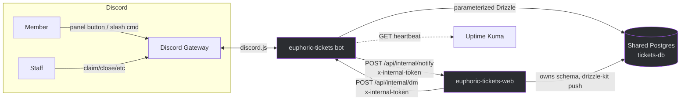
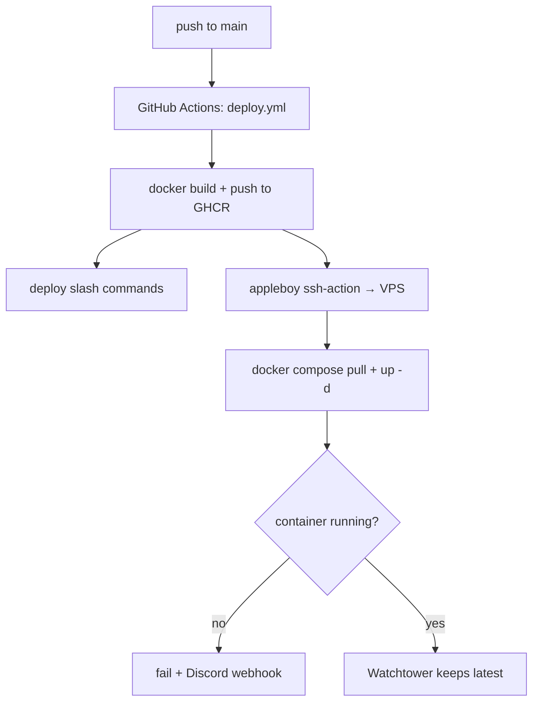
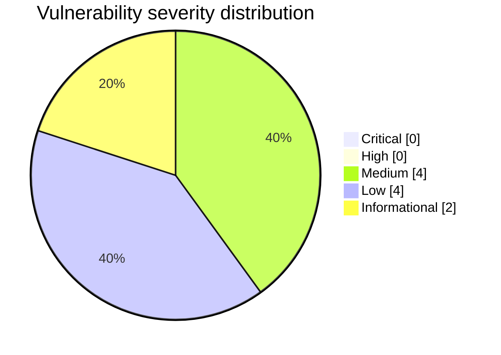

# Security & Architecture Review — Euphoric Tickets (Discord bot)

- **Repository:** `jason-tucker/euphoric-tickets`
- **Reviewed commit:** `d7c4c51` (v0.7.0)
- **Branch:** `claude/pensive-dirac-4e5f7g`
- **Date:** 2026-06-09
- **Reviewer:** automated multi-agent review (read + manual verification of every flagged finding)
- **Scope of fixes applied this pass:** high-severity only (F1, F2, F4, F5). F3/F6/F7/F8/F9 documented as follow-ups (see `REMEDIATION_PLAN.md`).

---

## Executive summary

This is the Discord half of a two-app system (a companion Next.js web app owns
the shared Postgres schema). It is a single Node/TypeScript service that holds a
Discord gateway connection and exposes a tiny **internal** HTTP server (DM
dispatch + TicketTool control) on a private docker network. There is **no public
HTTP API, no browser frontend, and no AI/LLM/RAG/agent/tool-calling** component.

**Overall risk: LOW–MODERATE.** Contrary to the "assume rushed / vibe-coded"
brief, the codebase is disciplined:

- **No SQL injection surface** — every query goes through Drizzle's parameterized
  builder; the two raw ``sql`...` `` fragments interpolate only schema column refs
  and DB-side values, never user input (`scheduledCleanup.ts:37,61`).
- **No exposed secrets** — current files and full git history are clean;
  `.env.example` uses placeholders; `.gitignore` covers `.env*`.
- **Good mention hygiene** — user-derived text is sent with
  `allowedMentions: { parse: [] }` throughout, so `@everyone`/role-ping injection
  via subjects, renames, templates, and status footers is not possible.
- **HTML transcript is escaped** — `transcriptService.escapeHtml` covers content,
  author, channel/guild names, and attachment URLs/names; the file is DM'd to the
  opener only (self-XSS at most, on Discord-CDN URLs).
- **Sound permission helpers** for slash commands (`resolveTicketAccessByChannel`
  resolves the ticket's *own* team in multi-team guilds).

The real findings are a tier below "critical": credential **blast-radius / reuse**
on the internal token, a **missing authorization re-check** at the close-confirm
step, and **infra hygiene** (Docker build context, container user, CI pinning).
The two research sub-agents initially rated several items "Critical IDOR"; direct
reading of the handlers **refuted** those (Discord button interactions cannot be
forged for channels the user can't see), so they were down-rated to Medium/Low.

**Safe to deploy?** The applied fixes (F1, F2, F4, F5) are behavior-preserving and
pass `tsc --noEmit`. They are committed to `claude/pensive-dirac-4e5f7g` only —
**not pushed, no PR, no production deploy** (per the operator's instruction). See
`DEPLOYMENT_AND_ROLLBACK.md`.

### Biggest issues fixed

1. **F2** — `executeCloseConfirm` had no authorization check, and `/tickets close`
   posted the destructive "Close & delete" confirm **publicly**; an added
   (non-staff/non-opener) ticket member could delete the channel. Now re-checks
   `canClose` and the confirm is ephemeral.
2. **F1 / F5** — the internal HTTP secret falls back to the **Discord bot token**
   and was compared with a non-constant-time `!==`. Now a constant-time compare,
   plus a loud startup warning and documented `INTERNAL_TOKEN`.
3. **F4** — no `.dockerignore`; `COPY . .` could pull `.git` / a local `.env` into
   a build layer & cache. Added a `.dockerignore`.

### Biggest remaining risks (not fixed this pass — see REMEDIATION_PLAN.md)

- **F3** — button/list handlers (`ticketClose`, `ticketClaim`, `/tickets list`,
  `changecat`) authorize against the **guild-default** team's roles rather than the
  ticket's own team; on a multi-team server this allows cross-team staff actions
  (bounded by Discord channel visibility). Deferred because it is the change with
  the most behavior-shift risk and warrants its own focused PR.
- **F6** — container runs as **root** and ships devDependencies (incl. the one
  `pnpm audit` advisory) into the runtime image.
- **F7** — CI third-party action `appleboy/ssh-action` pinned by tag (not SHA); no
  dependency/secret/SAST/SBOM gate.
- Operational: rotate nothing (no leak found), but **set a dedicated
  `INTERNAL_TOKEN`** on both bot and web to retire the bot-token fallback.

---

## Coverage

| Area | Status | Reason / evidence |
|---|---|---|
| Repo mapping & data-flow | completed | This report; `THREAT_MODEL.md` |
| Threat model | completed | `THREAT_MODEL.md` |
| Secrets (files + git history) | completed | `git log -S` + ripgrep token-shape scan — none found |
| Dependencies / supply chain | completed | `pnpm audit` (1 moderate, dev-only); `DEPENDENCY_AND_SBOM_NOTES.md` |
| Static AppSec (injection/XSS/SSRF/authz) | completed | Manual read of all 60 `src/` files + 2 sub-agents |
| Auth / authz / multi-tenant isolation | completed | `permissions.ts` + every handler traced; F2 fixed, F3 documented |
| Internal HTTP API review | completed | `internalHttp.ts`; F1/F5 fixed |
| AI / LLM / RAG / agent safety | not applicable | No AI components anywhere in the repo |
| Infra / Docker / compose | completed | F4 fixed; F6 documented |
| CI/CD (`deploy.yml`) | completed | F7 documented |
| Performance / reliability | partial | Timeouts/shutdown/concurrency noted (F8) — documented, not changed |
| Database / migrations | completed | Bot does not own schema; no migrations in this repo |
| Tests | not executed | No test framework present (F9); verification via `tsc --noEmit` |
| DAST / staging deploy | not executed | No reachable target; bot needs live Discord token + shared DB |

---

## Findings register

| ID | Sev | Conf | Category (CWE) | File:line | Impact | Fix | Status |
|---|---|---|---|---|---|---|---|
| F1 | Medium | High | Credential reuse / hardcoded-ish secret (CWE-522, CWE-798) | `internalHttp.ts:19-21`, `notifyBridge.ts:16` | Bot token doubles as internal HTTP secret in both directions; leak of either app compromises the bot account | Constant-time compare + startup warning + documented `INTERNAL_TOKEN`; recommend dedicated token (manual) | **Fixed (mitigation)** + residual config action |
| F2 | Medium | High | Missing authorization (CWE-862/863) | `tickets.ts:555-573, 836-877` | An added non-staff/non-opener ticket member could click a public "Close & delete" and delete the channel | Re-check `canClose` in `executeCloseConfirm`; make `/tickets close` confirm ephemeral | **Fixed** |
| F3 | Medium | High | Improper authorization / tenant isolation (CWE-863/639) | `ticketClose.ts:28`, `ticketClaim.ts:24`, `ticketChangeCategory.ts:24,69`, `tickets.ts:663` | Multi-team guild: actions authorized vs guild-default team, not the ticket's team; cross-team staff actions (bounded by channel visibility) | Route button/list handlers through `resolveTicketAccessByChannel` like the slash commands | **Documented (deferred)** |
| F4 | Medium | High | Secret/data in build artifact (CWE-538/200) | `Dockerfile:10` (no `.dockerignore`) | `COPY . .` can pull `.git`/local `.env`/`.claude` into a builder layer & build cache | Added `.dockerignore` | **Fixed** |
| F5 | Low→Med | High | Timing side-channel (CWE-208) | `internalHttp.ts:40` | `!==` on the shared secret leaks match length via timing | `crypto.timingSafeEqual` with length guard | **Fixed** |
| F6 | Low | High | Least privilege / image hygiene (CWE-250) | `Dockerfile` | Container runs as root; prod image ships devDeps incl. esbuild advisory | Add `USER node`; prune devDeps from runtime stage | **Documented (deferred)** |
| F7 | Low | High | Supply chain / CI (CWE-1357) | `.github/workflows/deploy.yml` | `appleboy/ssh-action` & docker/* pinned by tag; no dep/secret/SAST/SBOM gate | Pin third-party actions to commit SHA; add a non-blocking security workflow | **Documented (deferred)** |
| F8 | Low | Med | Reliability | `healthPush.ts:13`, `notifyBridge.ts:19`, `index.ts`, `leader.ts:26` | `fetch()` without timeout; internal HTTP server not closed on shutdown; `LEADER_ELECTION` read unvalidated | Add `AbortSignal.timeout`; `server.close()` on shutdown; validate flag | **Documented (deferred)** |
| F9 | Low | High | Test coverage | (whole repo) | No tests → no regression safety net | Add `vitest` unit suite for pure helpers (`tokenMatches`, `escapeHtml`, `validatePanelCategoriesJson`, slugify) | **Documented (deferred)** |
| F10 | Info | Med | ReDoS-ish / unbounded work | `ticketToolIngest.ts`, `messageBackfill.ts` | Regex on untrusted TicketTool embed text; unbounded reconcile/reprocess concurrency | Cap input length before regex; bound concurrency | **Documented (deferred)** |
| F11 | Info | High | Predictable temp file | `scripts/lantern-bootstrap.sh:30` | Fixed `/tmp/.b` path (dev-only scaffolding tool, not in runtime) | Use `mktemp` | **Documented (deferred)** |

Refuted during verification (recorded so they aren't re-raised): "Critical IDOR"
on `tk:changecat_sel` / `tk:close_confirm` / `tk:close` / `tk:claim` via a
forged `ticketId` — **refuted**: Discord clients cannot trigger a button
interaction for a message/channel the user cannot see, and these handlers operate
on the channel the interaction occurs in. The residual real issue is the
multi-team *team-resolution* drift, captured as F3.

---

## Diagrams

### System / data-flow

Trust boundaries: (1) Discord ↔ bot (untrusted users/content), (2) web ↔ bot
internal HTTP on the private docker network (shared-secret auth — F1/F5),
(3) bot ↔ shared Postgres.

### Deployment pipeline

### Severity distribution

(Medium = F1–F4 counting F5 with F1's mitigation as one credential issue is also
valid; here F1, F2, F3, F4 are the four Mediums, F5–F8 the four Lows, F10–F11 the
two Informationals, F9 folded into Low.)
